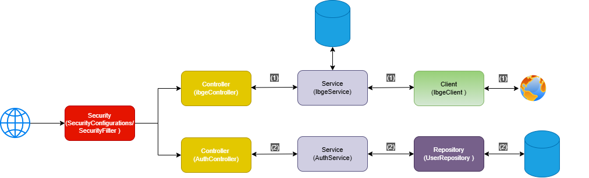

# 🏛️ Government API - Integração IBGE


Aplicação back-end desenvolvida com **Spring Boot** que atua como uma ponte otimizada, segura e resiliente para o consumo de dados públicos da API do IBGE (Estados, Regiões e Municípios).

O sistema foi desenhado com foco em performance e boas práticas arquiteturais, implementando autenticação stateless, cache em memória, consumo reativo de APIs externas e tratamento global de exceções.

---

## 🎯 Principais Funcionalidades

- **Autenticação Segura:** Login e registro baseados em JWT (JSON Web Tokens) com senhas criptografadas (BCrypt).
- **Integração Desacoplada:** Consumo da API pública do IBGE isolado da regra de negócio da aplicação.
- **Cache Inteligente:** Utilização do Redis para armazenar respostas da API externa, reduzindo drasticamente a latência em requisições repetitivas.
- **Tratamento de Erros:** Padronização de respostas de erro e exceções customizadas (`ApiException`).
- **Testes Automatizados:** Alta cobertura de código com testes unitários e de integração validando controllers, services e fluxo de cache.

---

## 🛠️ Tecnologias Utilizadas

- **Linguagem & Framework:** Java 17+ e Spring Boot 3
- **Segurança:** Spring Security + JWT (Auth0)
- **Comunicação Web:** Spring WebFlux (WebClient) para consumo reativo
- **Banco de Dados:** PostgreSQL (Dados de Usuário) e Redis (Cache)
- **Infraestrutura:** Docker e Docker Compose (Autoconfigurado pelo Spring Boot)
- **Testes:** JUnit 5, Mockito e MockMvc
- **Documentação:** Swagger (Springdoc OpenAPI)

---

## 🏗️ Arquitetura e Decisões Técnicas



A aplicação segue uma arquitetura em camadas bem definida (`Security Filter` → `Controller` → `Service` → `Repository / Client`), garantindo a separação de responsabilidades.

**Destaques Técnicos:**
1. **WebClient Buffer Adjustment:** Para lidar com grandes volumes de dados da API do IBGE (como a listagem de todos os municípios de MG), a estratégia de troca de mensagens  do WebClient foi configurada para suportar buffers maiores de memória nativa.
2. **Resolução de Self-Invocation do Proxy do Spring:** O problema clássico de chamadas internas ignorarem as anotações do Spring (como o `@Cacheable`) foi resolvido no `IbgeService` utilizando a técnica de **Auto-injeção (Self-Injection com @Lazy)**. Isso permitiu reaproveitar dados em cache sem gerar erro de dependência circular na inicialização da aplicação.

---

## 📡 Endpoints da API

A documentação interativa completa (com schemas e testes em tempo real) pode ser acessada via Swagger UI rodando a aplicação e acessando: `/swagger-ui.html`.

### Autenticação
- `POST /auth/login` — Autentica um usuário e retorna o token JWT.
- `POST /auth/register` — Registra um novo usuário no sistema.

### IBGE Data (Requer Token JWT)
- `GET /states` — Retorna todos os estados (UFs) brasileiros.
- `GET /regioes` — Retorna as macrorregiões do país.
- `GET /states/{uf}/municipalities` — Retorna todos os municípios de um estado específico.
- `GET /municipalities` — Retorna a lista completa de todos os municípios do Brasil.
- `GET /municipalities/search?name={nome}` — Busca e filtra municípios por parte do nome.

---

## 🚀 Como Executar o Projeto

Graças ao suporte nativo do Spring Boot 3 ao Docker Compose, toda a infraestrutura de banco de dados e cache é inicializada automaticamente ao rodar o projeto.

### Pré-requisitos
- Java 17+ instalado
- Maven 3.8+
- **Docker** rodando na máquina (o Spring subirá os contêineres sozinho)

### Passos
1. Clone este repositório e entre na pasta do projeto:
   ```bash
   git clone [https://github.com/seu-usuario/government-api.git](https://github.com/seu-usuario/government-api.git)
   cd government-api
   ```
2. Configure a variável *secret* do JWT no arquivo `application.properties` (as credenciais do banco e do Redis já são gerenciadas pelo docker-compose).
3. Rode a aplicação utilizando o Maven:
   ```bash
   mvn spring-boot:run
   ```
4. A API estará disponível em `http://localhost:8080`.
5. Acesse a documentação interativa (Swagger) em `http://localhost:8080/swagger-ui.html`.

---

## 🤝 Colaboradores

| [Daniel Sodré](https://github.com/daniel-sd03) |
| :--------------------------------------------: |